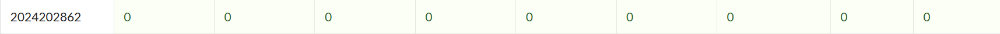

| 总分 | phase_1 | phase_2 | phase_3 | phase_4 | phase_5 | phase_6 | secret_phase | pupil|tr1vial |
| --------- | ------------- | ------------- | ------------- | ----------------- |-----------|-----------|-----------|--|--|
| 9        | 1            | 1            | 1            | 1 |1  |1  |1  | 1 | 1|


scoreboard 截图：



<!-- TODO: 用一个scoreboard的截图，本地图片，放到 imgs 文件夹下，不要用这个 github，pandoc 解析可能有问题 -->

## 解题报告

<!-- 对你拆掉的每个phase进行分析，并写出你得出答案的历程 -->

<!-- 如果能用伪代码还原题目源代码最佳（不属于先前提到的大段代码），语言描述自己的分析也可，每道题目的图片不建议超过两张 -->

### phase_1

#### 答案
```c
https://www.youtube.com/watch?v=dQw4w9WgXcQ
```

#### 思路
第一题很简单，读入用户输入的字符串，与 ```0x555555557180``` 处的字符串作比较，若不相同则调用 ```explode_bomb()``` ,炸弹爆炸。

通过
```c
(gdb) x/s 0x555555557180
```
得到答案为 ``` https://www.youtube.com/watch?v=dQw4w9WgXcQ ```.

### phase_2

#### 答案
```c
481702 736928 443338 675456
```

#### 思路
转换为 C 代码如下：
```c
int matA[2][3] = {
    {137, 583, 620},
    {427, 328, 636}
};
int matB[3][2] = {
    {426, 624},
    {640, 960},
    {81, 148}
};

long long phase_2(const char *input) {
    int a0,a1,a2,a3;
    int computed[4];

    if (sscanf(input, "%d %d %d %d", &a0, &a1, &a2, &a3) != 4)
        explode_bomb();

    int *pA = &matA[0][0];  
    int *out = computed;

    for (int i = 0; i < 2; ++i) {
        int *pB = &matB[0][0];  
        for (int col = 0; col < 2; ++col) {
            int sum = 0;
            for (int k = 0; k < 3; ++k)
                sum += pA[k] * pB[2*k];
            
            out[col] = sum;
            ++pB; 
        }
        pA += 3;
        out += 2;
    }

    int inputs[4] = {a0, a1, a2, a3};
    for (int i = 0; i < 4; ++i) {
        if (inputs[i] != computed[i])
            explode_bomb();
    }
    return 0;
}
```

本题实现了一个矩阵乘法。通过命令 ```(gdb) info address matA.3``` 和命令 ```(gdb) info address matB.2``` 得到二维数组 matA 首地址位于地址 ```0x55555555a140``` ，二维数组 matB 首地址位于地址 ```0x55555555a120```, 进而得到两个二维数组中存储的具体值。

分析汇编代码，```phase_2``` 核心逻辑由三重循环构成，分别对应矩阵的行、列及内积运算。外层循环控制矩阵 ```A``` 的行指针 ```pA```，每次向后移动 3 个元素以处理下一行；中层循环控制矩阵 ```B``` 的列指针 ```pB```，在每行中依次计算当前行与各列的点积；内层循环完成具体的乘加操作，将对应元素相乘后累加至寄存器中形成部分和。
通过矩阵乘法运算得到答案为 ```481702 736928 443338 675456```.


### phase_3
#### 答案
```c
0 337
```

#### 思路
转化为 C 代码如下:
```c
int delta_1 = 494;

int phase_3(const char *input)
{
    int choice, value, expected;

    if (sscanf(input, "%d %d", &choice, &value) <= 1)
        explode_bomb();

    // 根据第一个输入 choice 计算期望值
    switch (choice) {
        case 0: expected = 831 - delta_1; break;
        case 1: expected = 730 - delta_1; break;
        case 2: expected = 804 - delta_1; break;
        case 3: expected = 711 - delta_1; break;
        case 4: expected = 503 - delta_1; break;
        case 5: expected = 589 - delta_1; break;
        case 6: expected = 319 - delta_1; break;
        case 7: expected = 795 - delta_1; break;
        default: explode_bomb();
    }

    // 检查第二个输入是否匹配期望值
    if (value < 0 || value != expected)
        explode_bomb();

    return 0;
}
```
本题的汇编实现了一个 switch-case 分支结构跳转，根据用户输入的第一个数字来决定跳转路径。通过分析分支条件可知，每个 case 会用一个特定的数减去偏移量得到期望值，并在分支后将期望值与输入的第二个数作比较，若不相等则炸弹爆炸。

通过 ```(gdb) x/d 0x55555555a110``` 得到偏移量 ```delta_1 = 494```

选择输入第一个数字 0，分析汇编发现寄存器 ```%eax``` 中的数字为 ```0x33f``` ,故用 ```831-497``` 得到期望的输入 ```337``` .故本阶段输入 ```0 337``` 即可.


### phase_4
#### 答案
```c
31 AC
```
#### 思路
转成 C 代码如下：
```c
int func4_1(int n) {
    int res = 0;
    if (n > 0) {
        res = n;
        if (n != 1) 
            return 2 * func4_1(n-1) + 1;
    }
    return res;
}

void func4_2(int n, int index, char a, char b, char c, char *out)
{
    if (n == 1) {
        out[0] = a;
        out[1] = b;
        out[2] = '\0';
    } else {
        int temp = n - 1;
        int 8 = func4_1(next_n); 

        if (8 >= index) {
            func4_2(temp, index, a, c, b, out);
        } else if (8 + 1 == index) {
            out[0] = a;
            out[1] = b;
            out[2] = '\0';
        } else {
            func4_2(temp, index - 8 - 1, c, b, a, out);
        }
    }
}

int phase_4(char *input)
{
    int num;
    char str[3];    
    char res[3];  

    if (sscanf(input, "%d %2s", &num, str) != 2)
        explode_bomb();

    if (num != func4_1(5))
        explode_bomb();

    if (string_length(str) != 2)
        explode_bomb();

    func4_2(5, 13, 'A', 'C', 'B', res);

    if (strings_not_equal(str, res))
        explode_bomb();

    return 0;
}
```
由 ```func4_1``` 代码计算得到 ```func4_1(5) == 31``` ,故可以知道输入的第一个数字应为31.分析汇编代码，发现 ```func4_1``` 实现的是求解汉诺塔问题中，移动盘子总数是 ```n``` 时第 ```index``` 步的盘子移动情况。
分析代码，将移动 ```n``` 个盘子分解成两个部分：先移动 ```n-1``` 个盘子，再移动最后一个盘子。
- 当索引 ```index``` 小于等于移动 ```n-1``` 个盘子的次数时，说明此时位于前半段，则递归地查询这一步的移动情况；

- 当索引为移动最大盘子的步骤时，最大盘由 ```a``` 移动到 ```b``` ，直接输出```ab```；

- 其余情况下，索引位于后半段，目标是把剩下的 ```n−1``` 个盘从 ```c``` 移动到 ```b```，递归地查询移动情况。

写一个脚本模拟一下，得到 ```n == 31, index == 13``` 输出 ```AC```.

最初在做这一题的时候，我只看懂了简单的 ```func4_1``` ，完全没有理解```func4_2```的递归逻辑。但我敏锐地注意到了 ```phase_3``` 完成后的输出 ```Ancient monks moved sacred disks between poles...```，于是我立刻产生了一个大胆的猜测： ```phase_4``` 可能是汉诺塔。同时我发现 ```phase_4```调用的参数是 ```A C B```,且要求输入的第二个字符串长度为 ```2```，于是我在几乎完全没看懂 ```func4_2``` 的情况下尝试了 ```AB BA AC``` 等组合，在尝试到 ```AC``` 的时候成功解决了这一阶段。


### phase_5
#### 答案
```c
``aeeo
```
#### 思路
转成 C 代码：
```c
int array_0[] = {2, 10, 6, 1, 12, 16, 9, 3, 4, 7, 14, 5, 11, 8, 15, 13};                     

char *phase_5(char *a1, char *a2)
{
    char *ptr;
    char *end;
    int sum = 0;

    if (string_length(a1) != 6) {
        explode_bomb();
    }

    ptr = a1;       
    end = a1 + 6;    

    while (ptr != end) {
        char ch = *ptr;
        int index = ch & 0xF; 
        sum += array_0[index];                        
        ++ptr;
    }

    if (sum != 59) {
        explode_bomb();
    }

    return ptr;
}
```
本阶段使用一个指针遍历输入的每一个字符，计算其 ```ASCII``` 码的低四位作为索引，并通过索引在给定数组中取值，将每次遍历取出的值累加，将最终结果与 ```59``` 作比较，若不相等则引爆炸弹。

使用脚本：
```python
array = [2, 10, 6, 1, 12, 16, 9, 3,
         4, 7, 14, 5, 11, 8, 15, 13]

target = 0x3b
L = 6

res = []
def dfs(pos, cur_sum, path):
    if pos == L:
        if cur_sum == target:
            res.append(path.copy())
        return
    for idx in range(16):
        s = cur_sum + array[idx]
        dfs(pos + 1, s, path + [idx])

dfs(0, 0, [])
if res:
    for comb in res[:10]:
        s = ''.join(chr((0x6 << 4) | idx) for idx in comb)
        print(s, comb)
```
模拟得到结果，输入 ``` ``aeeo```通过此阶段。

### phase_6

#### 答案
```c
5 3 2 6 4 1
```
#### 思路
转成 C 代码：
```c
typedef struct Node {
    int value;
    struct Node *next;
} Node;

void phase_6(char *input)
{
    int nums[6];      
    Node *nodes[6]; 
    int i, j;

    read_six_numbers(input, nums);

    for (i = 0; i < 6; ++i) {
        if (nums[i] < 1 || nums[i] > 6)
            explode_bomb(input, nums);

        for (j = i + 1; j < 6; ++j) {
            if (nums[i] == nums[j])
                explode_bomb(input, nums);
        }
    }

    // 根据输入数字选择链表节点
    for (i = 0; i < 6; ++i) {
        Node *cur = &node1;
        for (j = 1; j < nums[i]; ++j)
            cur = cur->next;
        nodes[i] = cur;
    }

    // 重建链表顺序
    for (i = 0; i < 5; ++i)
        nodes[i]->next = nodes[i + 1];
    nodes[5]->next = NULL;

    // 检查链表是否递增
    Node *cur = nodes[0];
    for (i = 0; i < 5; ++i) {
        if (cur->value > cur->next->value)
            explode_bomb(input, NULL);
        cur = cur->next;
    }
}
```
本题通过读入六个数字作为索引，根据读入数字顺序重新连接节点组成新链表，然后检验新链表节点的值是否升序排列，若不是则引爆炸弹。

访问内存得到六个节点为 ```node1:717 node2:251 node3:128 node4:711 node5:106 node6:257```，按对应值升序排列索引得到答案为 ```5 3 2 6 4 1```.

### secret_phase
### 答案
```c
33022
```

### 思路
转 C 代码如下：
```c
int dx[8] = {-2, -1, 1, 2, 2, 1, -1, -2};
int dy[8] = {1, 2, 2, 1, -1, -2, -2, -1};

int adj_x[8] = {-1, 0, 0, 1, 1, 0, 0, -1};
int adj_y[8] = {0, 1, 1, 0, 0, -1, -1, 0};

// 棋盘
int board[8][8] = {
    {0,0,1,0,0,1,0,0},  
    {0,0,0,1,0,0,0,1},  
    {1,0,1,0,0,1,0,0}, 
    {1,0,0,0,0,0,0,0},  
    {0,1,0,0,1,0,1,0},  
    {1,0,0,1,1,0,0,0},  
    {0,0,0,0,0,1,0,1},  
    {0,1,0,0,0,0,0,0},  
};

int func7(int x, int y, int step, int path[20])
{
    if (step > 19) return 0;           
    int val = path[step];
    if (val == 0) return 1;           

    int idx = val & 7;              
    int target_x = x + dx[idx];
    int target_y = y + dy[idx];

    if (target_x < 0 || target_x >= 8 || target_y < 0 || target_y >= 8)
        return 0;

    int aux_x = x + adj_x[idx];
    int aux_y = y + adj_y[idx];
    if (aux_x >= 0 && aux_x < 8 && aux_y >= 0 && aux_y < 8) {
        if (board[aux_x][aux_y] == 1) return 0;
    }

    if (board[target_x][target_y] == 1) return 0;

    return func7(target_x, target_y, step + 1, path);
}

int secret_phase()
{
    int line; 
    puts("Wait! Is there a horse?");
    line = read_line();
    if ( (int)string_length(line) > 20 )
        explode_bomb();
    if ( !(unsigned int)func7(line, 0, 0, 0) )
        explode_bomb();
    puts("Wow! The horse gallops to victory! You are a master!");
    return phase_defused();
}
```
该阶段核心是一个递归路径验证函数 ```func7```，结合一个固定的 8×8 棋盘 board，实现了类似象棋中“马”的行走路径检测的逻辑。

```func7``` 递归检查路径是否合法：

- 若 `step > 19` ，说明已超出最大允许步数，返回 `0`（失败）。

- 取当前步的方向 ```val = path[step]``` .若为 `0`，说明路径结束，返回 `1`（成功）。

- 计算目标位置 ```(target_x, target_y)```。若越界或被障碍阻挡，则失败。

- 检查位置 ```(aux_x, aux_y)``` 是否有障碍。

- 若无阻碍，则递归进入下一步。

整个递归在任一步失败都会返回 `0` ，走完整条路径则返回 `1` 。

在 ```secret_phase``` 中，当输入路径字符串能引导“马”在棋盘上完成一条合法的路径(从```(0, 0)``` 到 ```(4, 7)```)序列时，炸弹被拆除。

我使用了一个脚本搜索解法，得到方向 ```33022``` 是合法的。

## 反馈/收获/感悟/总结
这个 lab 第一个让我感到开心的地方在于我成功进行了炸弹安全化，或者更确切地说，阻止了爆炸的炸弹向服务器发送通知。我通过在 ```call   1deb <send_msg>``` 这一句处设置断点，然后直接跳到 ```call   1190 <exit@plt>``` 这一句处，完整地跳过了 ```send_msg``` 函数的执行，从而使得服务器无从知道我的炸弹爆炸了。同时为了万无一失，我通过在进入 ```phase_defused``` 函数的第一句话处设置断点，然后直接跳到 ```ret``` 处，避免了同服务器的通信.在第一次忐忑不安地在输入 ```(gdb) run``` 后，发现的确没有将爆炸信息发送到服务器，我感到非常快乐(当然，在两分钟后当我发现 ```phase_1``` 的答案是 ```Never Gonna Give You Up``` 的YouTube视频链接以后我更快乐了)。

整个 `lab` 的 `7` 个阶段做得非常爽，但后面两个阶段对我来说感觉难度还是太大，我在求助 *AI* 与使用 *IDA* 的情况下也还是花了好几个小时。在最后的 ```secret_phase``` 破解之后， 那种成就感绝对是无与伦比的。

在拆弹过程中，我加深了对汇编语言的理解，更好地掌握了程序的控制结构，对程序的底层有了一个初步的理解。

总之，体验很棒！感谢助教师兄师姐们的付出，赞美 ```bomblab```!
<!-- 这一节，你可以简单描述你在这个 lab 上花费的时间/你认为的难度/你认为不合理的地方/你认为有趣的地方 -->

<!-- 或者是收获/感悟/总结 -->

<!-- 200 字以内，可以不写 -->

## 参考的重要资料
- [CSAPP | Lab2-Bomb Lab 深入解析](https://zhuanlan.zhihu.com/p/472178808)

> `CSAPP` 原版 `BombLab` 解析，帮助我了解了完成这个 `Lab` 的一些基础知识

- [汇编语言入门教程](https://www.ruanyifeng.com/blog/2018/01/assembly-language-primer.html)

> 汇编语言入门，虽然是 *Intel* 语法

- [更适合北大宝宝体质的 Bomb Lab 踩坑记](https://arthals.ink/blog/bomb-lab)

> 对我帮助最大，特别是其中跳过 `send_msg` 函数的部分
<!-- 有哪些文章/论文/PPT/课本对你的实现有重要启发或者帮助，或者是你直接引用了某个方法 -->

<!-- 请附上文章标题和可访问的网页路径 -->