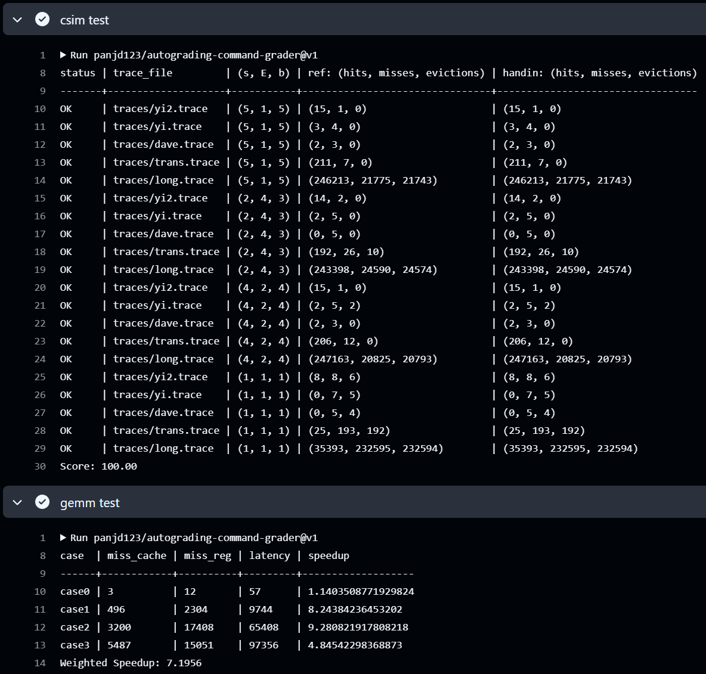
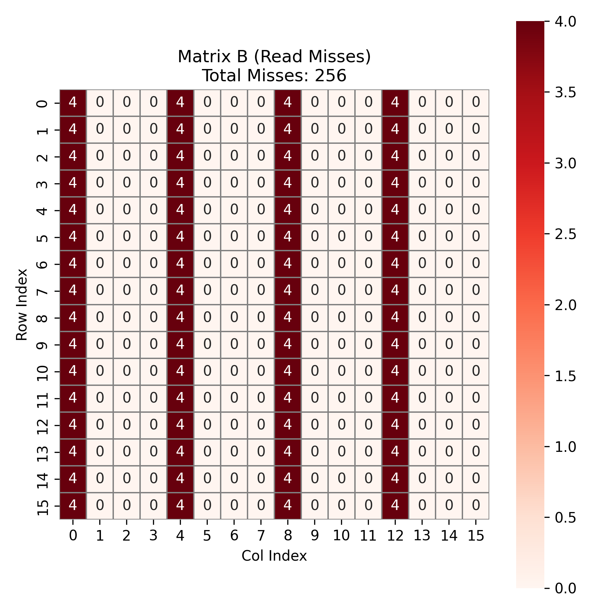
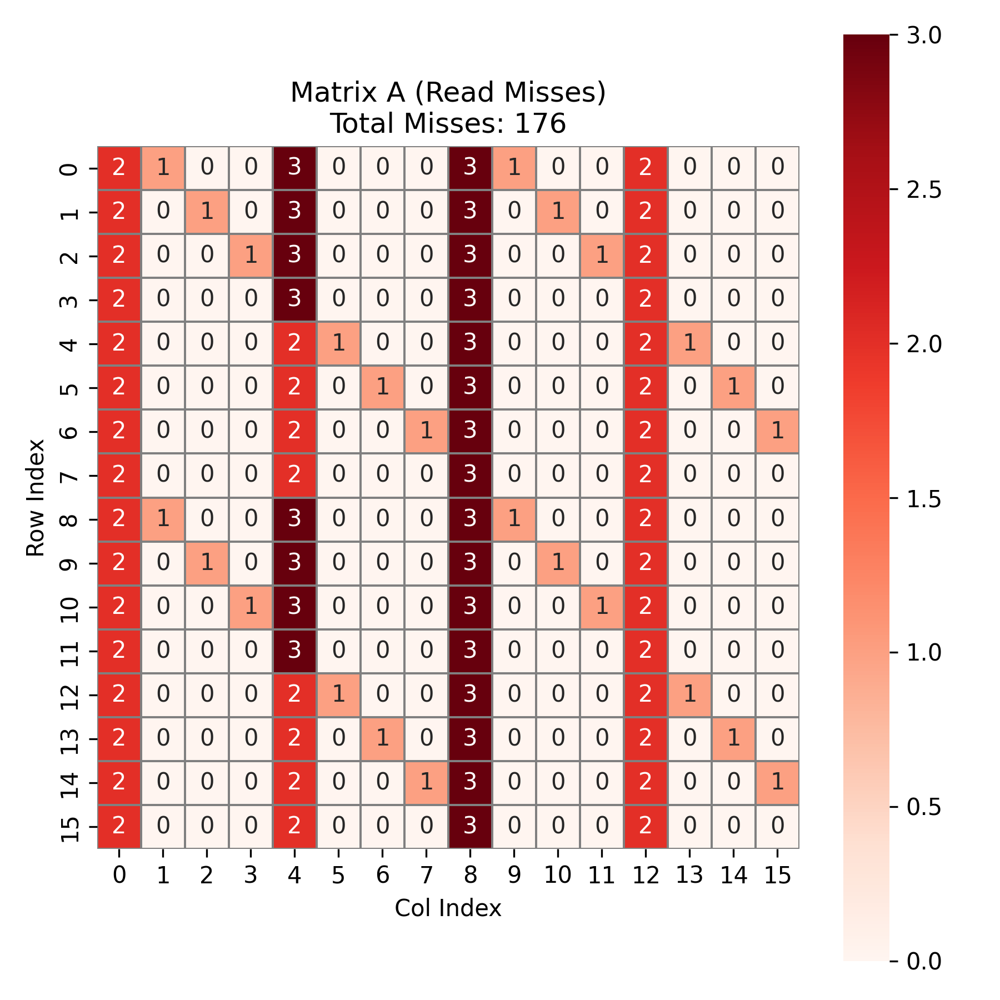
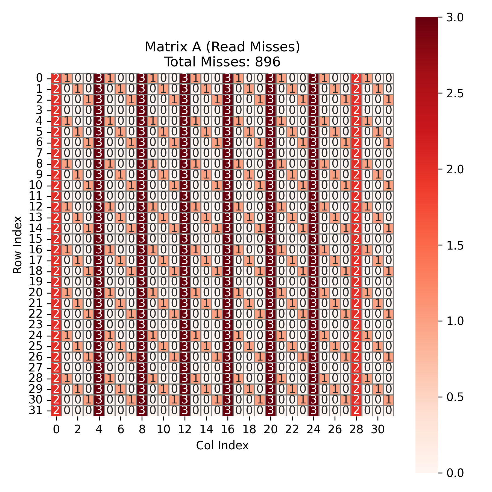

| csim 分数 | case1 speedup | case2 speedup | case3 speedup | weighted speedup |
| --------- | ------------- | ------------- | ------------- | ----------------- |
| 100.00         | 8.24             | 9.28             | 4.85            | 7.20               |

Autograder 截图：



<!-- 保留两位小数，四舍五入 -->

<!-- 请同时将 Github Action 中的 csim test 和 gemm test 展开截图，并保证左上角出现你的仓库名，你可能需要调整浏览器缩放 -->

<!-- 如果 Github Action 不可用，本地的两个 test 的运行截图也可以-->

## Part A: cache 模拟器

### 实现简述

<!-- 简述 LRU 替换策略的 cache 的具体实现细节 -->

缓存的核心数据结构由 ```class Line``` 表示，其中包含 ```valid``` 位、```tag``` 和用于实现 `LRU` 策略的 ```last_used```。

对于每一次内存访问，程序会根据地址计算对应的 `set index` 与 `tag`，随后搜索是否命中；若命中，则更新命中计数并设置行的时间戳。若未命中，则首先尝试填入空行；若没有空行，则依据 `LRU` 策略选出最久未使用的行进行替换，同时更新其 `tag` 与时间戳，并记录一次 `eviction`。对 `modify(M)` 指令，程序会执行两次访问，每次都更新命中计数与时间戳。

### 亮点
无
<!-- 如果你有模拟性能上的优化，或者别的什么亮点可以用额外的篇幅具体讲讲，否则留空就可。 值得一提，这作为了第36次CSP考试的大模拟原题。 -->

## Part B: 矩阵乘法优化

<!-- 下文请统一用 "行 * 列" 来表述矩阵形状 -->

<!-- 如果你想用 x, y 或者 i, j 变量来辅助你的表述，
请保证他们的对应关系是 x,y <=> i,j <=> 行,列，不然助教会晕，你们的分数也可能跟着晕，
我指你想说某个单独的矩阵中的 x 行 y 列的时候，不要说 y 行 x 列，
当然有三个矩阵的时候就没这回事了
 -->

### 亮点
- 矩阵分块
- 用寄存器预存矩阵数据，避免重复读取，从而减少 ```cache_miss``` 和 `reg_miss`
- `case3`矩阵二级分块
<!-- 这相当于摘要，用最精简且可以被理解的关键词 + 简短的句子，分点描述你所有使用到的优化技巧，如果他们的重要性不同，请按顺序讲 -->

<!-- 比如：1. 分块：xxxx -->

<!-- 由于你还需要在后文详细说明，因此不必在此大费周章 -->

#### 我认为的最优秀的实现排序

<!-- 请排序这三个 case，把你认为的最优秀的实现排在前面 -->

1. case1
2. case2
3. case3

> [!NOTE]
> 每个 ```case``` 上的多次调参以及较小的优化略过不表，只保留几次突破较大的优化。

### case1

<!-- 1. 展示你的 cache miss 和 register miss -->

<!-- 2. 分析你的算法的理论 miss，如果和实际不完全相符，误差可能来自于哪里
（通常你的分析不用完全准确，不影响后续你展示算法，或者不同算法性能的大小关系即可） -->

<!-- 3. 你是怎么想到你的方法的，2 和 3 点可以调换顺序或者合并。或者说你的方法有哪些巧妙的设计。 -->

<!-- 4. 我们预计准确分析理论 miss，甚至是大致分析都可能是相当费力的，
此时我们更偏向你挑选一个你最想分享的 case 认真分析，其他 case 可以草率一点。
但这不代表我们只看一个 miss 分析，而是在你精力有限时请把最精华的写出来。
不要费了功夫写了三个分析但每个都浅尝辄止。
我们认为的排序是：
三个都精细分析 > 精细分析一个，潦草分析两个 > 只精细分析一个 > 潦草分析三个
 -->

<!-- 5. 分析 naive 算法的 cache miss 原因，视总篇幅也可以不讲 -->

<!-- 不要贴大段的代码，如果需要贴代码，请一小节一小节，并配合文字解释 -->

<!-- 你可以贴伪代码，或者用注释替代不重要的部分，尽量让报告精简 -->

<!-- 虽然我们分成了 3 节分别对应每个 case，但你不用每次都重复描述共通的思路，你可以修改报告的形式 -->

<!-- 原则上，简单的方法一个 case 所需描述的字数不应超过 500 字，复杂的不应超过 1000 字 -->

<!-- 如果你没有什么优化思路，这一节也可以就讲 baseline 算法的 cache miss 的分析 -->

<!-- 如果你的优化思路特别多，请先分点简述一下，如果超出了我们的字数限制，请把最重要的部分在规定字数内先解释清楚，再用”明显的分割线“隔开，再接着写次重要的优化 -->

<!-- 尽量给出你每个优化，或者是渐进的优化中每一步对性能的提升分别是多少 -->


<!-- 如果你有除了 gemm_test.py 脚本算出来的 cache miss 和 register miss 的其他数据展示，比如你跑了个参数的网格搜索，
请保证这些数据是可复现的，给出复现的代码，和复现代码的执行方法文档。这些应该包含在提交仓库中
-->

#### 第一次优化

```naive GEMM``` 的缺点主要有：跨行访问严重、寄存器重复加载频繁。因此，拿到这个 ```case``` 我们首先想到：要消除不连续的访问、通过分块放大局部性收益。

由于假设的硬件环境为 ```s = 5，E = 1，b = 4``` ，所以一个 ```block``` 包含 ```16 bytes``` ，所以一个 ```line``` 恰好能存储 ```4``` 个 ```int``` 。所以只要让计算过程中每次访问的 ```A``` 或 ```B``` 的连续 `4` 个元素对齐到同一 ```block``` ，就能显著减少 ```miss``` 。在 $16 \times 16$ 的矩阵中，我们尝试采用 $4×4$ 分块，用分块后的小矩阵作为运算单元，运算后再归位并累加。这样分块使块内数据能正好落入一个 ```cache line``` 中，从而较好地利用空间局部性。

伪代码如下：

```c++
for k in 0..15 step 8:
    for j in 0..15 step 8:
        for i in 0..15 step 8:
            for ii in i..i+7:
                Load C[ii][j..j+7] into tempC[8]
                Load A[ii][k..k+7] into tempA[8]

                for kk in k..k+7:
                    Load B[kk][j..j+7] into tempB[8]

                    for t in 0..7:
                        tempC[t] += tempA[kk - k] * tempB[t]

                Write tempC back to C[ii][j..j+7]
```

这个优化的加速比为 ```5.63``` ， ```miss_cache``` 为 ```661``` ， ```miss_reg``` 为 ```4352``` 。

#### 第二次优化
在第一次优化中，我们似乎已经把矩阵分块方面做的很好了。所以我们想到，接下来可以**尽可能增加寄存器的复用**。很自然地想到 ```case0``` 的最终优化方法:把一个块内的数据全部读到寄存器内，然后暴力计算。但是如果要把块内数据全部读入寄存器，那么分块的大小就不能太大(因为我们只有```36```个寄存器可以用)，但如果分块太小，又会增加```cache miss```。但是在第一次优化中我们采用的 $ 4 \times 4 $ 分块恰好可以将块内的数据全部读入寄存器(内层```k```循环外维护```16```个寄存器，```k```循环内对```A```和```B```各维护```4```个寄存器，共```24```个)。

伪代码如下：
```c++
for i in 0..15 step 4:
    for j in 0..15 step 4:
        init reg temp[4][4] = 0

        for k in 0..15:
            Read A[i..i+3][k] as a[4]
            Read B[k][j..j+3] as b[4]

            for p in 0..3:
                for q in 0..3:
                    temp[p][q] += a[p] * b[q]

        Write temp[4][4] to C[i..i+3][j..j+3]
```

这种优化下加速比达到了 ```8.2438``` ， ```miss cache``` 为 ```496``` ， ```miss reg``` 为 ```2304``` 。

下面我们分析一下这个结果：

先分析矩阵 $C$ 。在内层循环结束之后，程序会在每个 ```block_i``` , ```block_j``` 块的末尾，一次性连续写入 $4 \times 4$ 的结果块。$C$ 矩阵总共 $16 \times 16 = 256$ 个元素。由于 $b=4$，每写入 ```4``` 个元素填满一个 ```cache Line``` 并触发一次 ```miss``` 。故总共有 $256 \div 4 = 64$ 次 ```miss``` 。如下图所示：


接下来是矩阵 $B$。在每个 ```block_i``` , ```block_j``` 的宏块内，```k``` 从 ```0``` 循环到 ```15``` ，这意味着我们遍历了 $B$ 的全部 ```16``` 行。由于 ```cache``` 只能容纳 $B$ 的一半，当读取 $B$ 的第 ```8``` 行时，会驱逐第 ```0``` 行的数据。因此，$B$ 矩阵完全没有时间局部性。所以，总共 ```16``` 个宏块，每个宏块内需要读取 $B$ 的全部 ```16``` 行数据。总共发生 $16  \times 16  = 256$ 次 ```miss```。如图所示：



最后是最难分析的矩阵 $A$ 。在理想情况下， $A$ 在 ```block_j``` 循环中是不变的。只有第一列 ```（block_j=0）```是冷不命中，后续三列```（block_j=4,8,12）```应该是 ```hit```。

但实际上，$A$ 和 $B$ 会竞争有限的 ```cache sets``` 。由于 $A$ 的读取方式是按列读取 ```4``` 行 ($a_0...a_3$)，且 ```block_i``` 对齐，故 **$A$ 的数据总是固定落在 ```cache``` 的 ```set 0, 4, 8, 12``` 与镜像的 ```set 16, 20, 24, 28``` 上**。而 $B$ 的读取随着 ```k``` 变化，其 ```set``` 映射会扫过 ```cache``` 。但是，```block_j``` 的不同偏移决定了 B 经过的起始 ```set``` 。

我们分析 $4 \times 4$ 个宏块的分布：

- 第一列：这是每个 ```block_i``` 的第一次读取，没有任何数据在 ```cache``` 中。固有 $4 \times 16  = 64$ 次冷不命中。

- 后三列：如果 $B$ 与 $A$ 产生了冲突 ，那么 $A$ 就会被驱逐。在某些块中（例如 ```block_j=0``` 及其对角线衍生位置），$B$ 的读取覆盖了 $A$ 所在的 ```set 0, 4...```，导致 $A$ 被踢出。当下一个块需要 $A$ 时，必须重新读取，于是产生了 ```miss``` 。在余下的 ```12``` 个本该复用的块中，有 ```7``` 个块被 $B$ 驱逐，只有 ```5``` 个块实现了复用。固有 $7$ 个冲突块 $\times$ $16$ 次读取 = $112$ 次 ```miss``` 。A 的总 ```cache miss``` 为：$64 + 112 = 176$ 次 ```cache miss``` 。如图所示：



综上，总共有 $64 + 256 + 176 = 496$ 次 ```cache miss``` ，与测试结果相符合。
### case2

> [!NOTE]
> ```case2``` 的思路与 ```case1``` 是类似的，这个部分就不过多分析了

由 ```case1``` 的分析，$4 \times 4$ 分块有良好的空间局部性，并且在参考附录中几篇文章的策略后， ```case2``` 中仍然采用 $4 \times 4$ 分块。

这个优化的加速比为 ```9.28``` ，```miss_cache``` 为 ```3200``` ，```miss_reg``` 为 ```17408``` 。

下面简单分析一下`cache_miss`。

对于矩阵 $C$ ，由于 $C$ 的大小为 $32 \times 32 = 1024$ ，故 ```miss``` 次数为 $1024 \div 4 = 256$ 次。如图所示：


对于矩阵 $B$ ，在每个`k`循环，由于`4`个`int`刚好装满一个 `cache block` ，故除第一次访问 `miss` ，之后 `3` 次为 `hit` 。故 `k` 循环走完会产生 `32` 次 `miss` 。而总共有`8`个 `block_i` 与 `8` 个 `block_j` ，故一共产生 $32 \times 8 \times 8 = 2048$ 次 `miss` 。如图所示：


对于矩阵 $A$，与 `case1` 中的情况是一样的，因 $A$ 与 $B$ 的冲突而产生 `miss` 。如图，总共有 `896` 次 `miss` 。



综上，总共与 $256 + 2048 + 896 = 3200$ 次 `miss` 。与测试结果相符合。

### case3
在一位师兄的建议与一篇博客的启发下，这个 `case` 我选择的策略是：对矩阵中可以分块的子矩阵分块，然后对边界剩余部分分别处理。

我们选择 $4 \times 5$ 作为输出矩阵 $C$ 的主分块大小。矩阵 $C$ 被划分为四个区域：

- 主体块区域：$ 28 \times 25 $ (行 0~27，列 0~24)，使用 $ 4 \times 5$ 分块完全覆盖。

- 右侧剩余列区域：$ 28 \times 4 $ (行 0~27，列 25~28)，使用 $4 \times 4$ 分块处理。

- 底部剩余行区域：$ 1 \times 25 $ (行 28，列 0~24)，使用 $ 1 \times 5 $ 分块处理。

- 右下角小块区域：$ 1 \times 4$ (行 28，列 25~28)。

如图：


这个 `case` 的伪代码如下：
```c++
for block_i in 0..M-3 step 4:      
    for block_j in 0..N-4 step 5: 
        init reg c[4][5] = 0

        for k in 0..K-1:
            Read A[block_i..block_i+3][k] as a[4]
            Read B[k][block_j..block_j+4] as b[5]

            for p in 0..3:
                for q in 0..4:
                    c[p][q] += a[p] * b[q]

        Write c[4][5] to C[block_i..block_i+3][block_j..block_j+4]

for block_i in 0..M-3 step 4:       
    init reg c[4][4] = 0

    for k in 0..K-1:
        Read A[block_i..block_i+3][k] as a[4]
        Read B[k][25..28] as b[4]

        for p in 0..3:
            for q in 0..3:
                c[p][q] += a[p] * b[q]

    Write c[4][4] to C[block_i..block_i+3][25..28]

for block_j in 0..N-4 step 5:      
    init reg c[1][5] = 0

    for k in 0..K-1:
        Read A[28][k] as a[1]
        Read B[k][block_j..block_j+4] as b[5]

        for p in 0..0:
            for q in 0..4:
                c[p][q] += a[p] * b[q]

    Write c[1][5] to C[28][block_j..block_j+4]

init reg c[1][4] = 0

for k in 0..K-1:
    Read A[28][k] as a[1]
    Read B[k][25..28] as b[4]

    for p in 0..0:
        for q in 0..3:
            c[p][q] += a[p] * b[q]

Write c[1][4] to C[28][25..28]
```

加速比为 ```4.85``` ， ```miss_cache``` 为 ```5487``` ， ```miss_reg``` 为 ```15051``` 。

下面我们简单分析一下 `cache_miss` 。

先分析矩阵 $C$ 。我们知道一个 `cache line` 可以存储 `4` 个 `int` ，而矩阵行、列并非 `4` 的倍数，所以 $C$ 的首地址并不是在一个 `cache line` 的 `0` 号位。计算后知道 $C$ 的首地址应该在 `line` 的 `3` 号位。同时，由于 $N=29$，每一行的起始地址相对于 `cache line` 的偏移量都会发生变化。由 $29 \mod 4 = 1$ ，我们知道每一行的起始位置都会比上一行右移一格。主循环中一次写入 `5` 个元素，占据 `20 bytes`。所以无论起始位置在哪，写入五个元素必然会跨越两个 `cache line` 。这意味着处理每一个 `block` 时，写入 $C$ 的一行往往需要触发 `2` 次 `miss`，而不是理想情况下的 `1` 次。如图， $C$ 的 `cache_miss` 为 `341` 次。


接下来是矩阵 $B$。外层循环 `BI` 步长为 `4`，处理矩阵需迭代 `7` 轮主循环（加上边缘处理共计约 `8` 轮扫描）。同时，每一轮扫描都会将前一轮的数据彻底替换。读取分块中的 `5` 个连续元素时，第一个元素占据了当前 `line` 的末尾，导致后续 `4` 个元素必须从下一个 `line` 中获取。由于 $B$ 是按列块扫描，地址跳跃大，`cache` 无法同时驻留两个 `line`，导致原本 `1` 次加载能完成的任务变成了 `2` 次 `miss`。如图，最终的 `miss` 为 `3282` 次。


$A$ 的 `cache miss` 分析难度很大，但可以知道 $A$ 的绝大部分行块在每一轮循环中都因为 $B$ 矩阵数据的涌入而被驱逐。也就是说，每一行每一轮都存在大量的冲突。具体的`miss`如下图所示。


综上，总共有 $341 + 3282 + 1864 = 5487$ 次 ```cache miss``` ，与测试结果相符合。

## 反馈/收获/感悟/总结

<!-- 这一节，你可以简单描述你在这个 lab 上花费的时间/你认为的难度/你认为不合理的地方/你认为有趣的地方 -->

<!-- 或者是收获/感悟/总结 -->

<!-- 我们会认真听取大家的建议～ -->
这个 `lab` 是我耗时最久、找资料时间最多、写的最难受的一个 `lab`。~~(也是求助大佬最多的一个lab)~~ 在对网上资料的阅读中，在对大佬与前辈思路的研究中，我也确实学到了很多知识，收获了很多成就感。

`case3`的优化与分析简直痛苦无比。特别感谢 `Gemini` ，她简直是神。我在 `case3` 上花的时间最多，但最后也没有取得特别好的效果。最后一个星期本想好好研究一下`case3`，再尝试一些优化策略，但由于实在太忙，最后也没有继续优化，这部分的报告也写得比较潦草。有心无力，也是一种遗憾吧。

同时也有一点想吐槽的地方，就是感觉 `Part 2` 的打榜最后往往变成大家疯狂调超参数，为了 `0.01` 的加速比进步而绞尽脑汁。我的感觉是，不如设置一个满分线，达到一定加速比这个`Part`就算满分。当然这仅仅是我个人的观点。

总之这是一个体验超级棒的 `lab` 。感谢助教师兄师姐的付出！

## 参考的重要资料

<!-- 有哪些文章/论文/PPT/课本对你的实现有重要启发或者帮助，或者是你直接引用了某个方法 -->

<!-- 请附上文章标题或概述和可访问的网页路径 -->

<!-- 不列出参考了的参考资料会被认为是学术不端 -->

- [更适合北大宝宝体质的 Cache Lab 踩坑记](https://arthals.ink/blog/cache-lab)

> 北大学长的 ```cachelab``` 指南，写的很详细，对一些坑点和难点解析很清楚，对我的 ```Part A``` 解决帮助很大

- [CSAPP - CacheLab (d-sketon.top)](https://d-sketon.top/20211015/csapp-cachelab/)

> 感谢这篇博客，为我的 ```Part B case3``` 提供了很好的思路，“凑分块”的想法由此而来，这篇博客对我的 ```Part B``` 优化帮助很大

- [通用矩阵乘（GEMM）优化与卷积计算](https://zhuanlan.zhihu.com/p/66958390)

> 很棒的解析，让我对各种优化策略有了更深的理解。我最开始做 `Part B` 就是从这里入门的