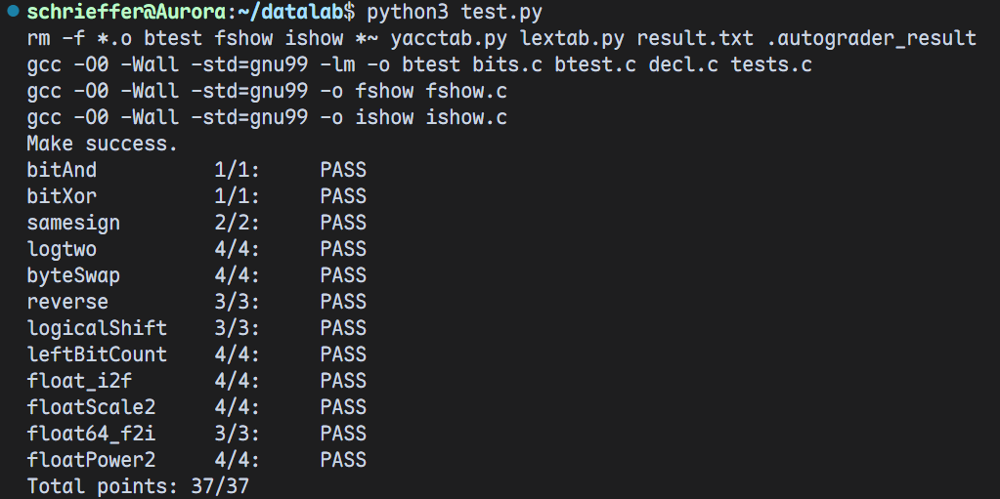

| 总分 | bitAnd | bitXor | logtwo | byteSwap | reverse | samesign | logicalShift | leftBitCount | float_i2f | floatScale2 | float64_f2i | floatPower2 |
| --------- |-------| ------------- | ------------- | ------------- | ----------------- |-----------|-----------|-----------|-----------|-----------|-----------|-----------|
| 37.00   |    1.00     | 1.00             | 4.00             | 4.00             | 3.00 | 2.00 | 3.00 | 4.00 | 4.00 | 4.00 | 3.00 | 4.00 |


test 截图：


<!-- TODO: 用一个通过的截图，本地图片，放到 imgs 文件夹下，不要用这个 github，pandoc 解析可能有问题 -->

## 解题报告

### **亮点**

<!-- 告诉助教哪些函数是你实现得最优秀的，比如你可以排序。不需要展开，展开请放到后文中。 -->

- *logtwo*
- *byteSwap*
- *floatScale2*

### logtwo
```c
int logtwo(int v) {
    int pos = 0;

    int shift = ((v >> 16) > 0) << 4;
    pos |= shift;
    v >>= shift;

    shift = ((v >> 8) > 0) << 3;
    pos |= shift;
    v >>= shift;

    shift = ((v >> 4) > 0) << 2;
    pos |= shift;
    v >>= shift;

    shift = ((v >> 2) > 0) << 1;
    pos |= shift;
    v >>= shift;

    shift = (v >> 1) > 0;
    pos |= shift;
    
    return pos;
}
```

- **亮点**：使用**二分查找**的思想确定有效最高位
本题的思路是找到 `v` 的有效最高位，也即找到第一个是 `1` 的位。在这里可以使用二分查找来找有效最高位。
如果 `v >> 16 > 0` ，说明高 `16` 位中有 `1` ，那么最高位一定在高 `16` 位，于是把位置向右移 `16` 位，并记录偏移量 `16` 。由于布尔表达式 `((v >> 16) > 0)` 为真时值为 `1` ，所以可以直接左移 `4` 位达到乘 `16` 的效果。以此类推，可以依次这样判断高 `8` 位、高 `4` 位、高 `2` 位以及第一位，并分别用左移代替乘法来记录偏移量，从而达到二分查找的效果。


### byteSwap
**亮点**：利用异或 (*XOR*) 运算实现字节交换
本题的思路是使用异或(*XOR*)运算达到交换的效果。由于异或运算的性质：`a ^ a = 0` , `a ^ b = b ^ a` ， `a ^ 0 = a` ，所以可以先通过异或运算求这两部分字节的“差异”，再通过两部分分别异或这个“差异”来转换成另一个字节。这个思路和不用临时变量实现两数交换的思想是类似的。  

- **求两个待交换字节的“差异”**
   - 首先分别将待交换字节移动到最低字节，异或求差异后将其他位设为0：
     ```c
     int diff = (((x >> (n << 3))) ^ ((x >> (m << 3)))) & 0xff;
     ```

-  **将待交换字节与“差异”异或**
   - 将“差异”放到待交换的字节位置，之后与 x 异或得到交换后结果
     ```c
     diff = (diff << (n << 3)) | (diff << (m << 3));
     return x ^ diff;
     ```

### floatScale2
**亮点**：特殊情况处理、分类
本题的思路是：
- 对于规格化数则增加阶码实现乘 `2` 。
- 对于非规格化数则左移尾数实现乘 `2`。
- 对于特殊值（ *NaN*、*Inf* ）则保持不变。

- **分解浮点数结构**
   - 首先提取符号位、阶码和尾数：
     ```c
     sign = uf & (1 << 31)
     exp = (uf >> 23) & 0xff
     frac = uf & 0x7fffff
     ```

- **处理特殊情况**
   - 若 `exp == 0xff`，说明 uf 是 NaN 或无穷大，直接返回原值：
     ```c
     if (exp == 0xff) return uf;
     ```

- **处理非规格化数**
   - 当 `exp == 0` 时，说明这是一个非规格化数。
   - 直接将尾数左移一位，相当于乘 2：
     ```c
     frac <<= 1;
     ```
   - 如果左移后最高位被移出，说明应当进位到阶码：
     ```c
     if (frac & (1 << 31)) {
         exp = 1;
         frac &= 0x7fffff;
     }
     ```

- **处理规格化数**
   - 当 `exp != 0 && exp != 0xff` 时，是正常的浮点数。
   - 阶码加 1，相当于乘 2：
     ```c
     exp += 1;
     ```
   - 若加 1 后阶码溢出到 0xff，说明结果为无穷大：
     ```c
     if (exp == 0xff)
         frac = 0;
     ```

- **重组得到结果**
   - 将符号位、阶码位、尾数位重新组合成 32 位浮点表示：
     ```c
     return sign | (exp << 23) | frac;
     ```

### bitXOR
用 `(x & y) | (~x & ~y)` 来模拟异或，但由于不允许使用 `|` ，所以使用德摩根律，即可得到结果  `~( x & y ) & ~( ~x & ~y)` 。

### samesign
本题主要需要注意对 `0` 的处理。若 `x` 与 `y` 均为 `0` 则返回 `1`，`x` 与 `y`中有一个为 `0` 时返回 `0` 。其他情况则通过将最高位（符号位）移到最低位，然后通过异或比较即可。

### reverse
本题思路是通过逐位提取和重组来完成 `32` 位整数的二进制反转。
```c
unsigned res = 0;
    for (int i = 0; i - 32; i++) {
        res <<= 1;
        res |= (v & 1);
        v >>= 1;
    }
```
使用一个循环迭代 `32` 次。每次循环中，将 `res` 左移一位，为当前最低位腾出位置；随后将输入 `v` 的最低位 `v & 1` 添加到结果末尾；最后将输入右移一位，为下一位的处理做准备。循环结束后， `res` 即为所求。

### logicalShift
本题的思路是首先对输入执行算术右移，然后用掩码去掉可能被符号扩展的高位。掩码的生成方法是：
```c
~(((1 << 31) >> n) << 1)
```
先生成一个最高位为 `1` 的数 `1 << 31`，即 `0x80000000` ，然后右移 `n` 位，接着左移一位并取反，得到高 `n` 位全为 `0` ，其余位为 `1` 的掩码。最后将结果与掩码按位与，从而得到逻辑右移的效果。这种实现思路结合了位移和掩码操作，保证了右移操作的逻辑正确性而不依赖条件分支。

### leftBitCount
本题也使用了**二分**的思想。

首先，用变量 `pos` 记录当前连续 `1` 的数量。随后，程序从高位到低位依次检测 `16` 位、`8` 位、`4` 位、`2` 位和 `1` 位。每次检测都通过构造掩码并判断当前区间是否全为 `1` 来实现。如果该区间确实全部为 `1`（即 `(x >> n) & mask == mask` ），则将 `pos` 增加对应的位宽，并保持 `x` 不变；若不全为 `1`，则将 `x` 右移对应位数，进入更小范围检测。第一次检查高 `16` 位是否全为 `1`，若是则至少有 `16` 个连续的 `1` ，否则右移 `16` 位继续判断。接着检查高 ·`8` 位是否全为 `1`，以此类推，直到逐位判断剩下的最高几位。最后的 `pos += !(x ^ 0xffffffff)` 用于检查最后一位是否为 `1` 。

### float_i2f
本题的思路是求出 *IEEE 754* 单精度浮点数位级表示的每一部分。

- **处理特殊情况**
   - 处理x == 0 和 x 是 int 类型下界的情况：
     ```c
     if (!x) return 0;
     if (x == 0x80000000) return 0xcf000000;
     ```

- **求出符号位，并取 x 绝对值**
   - 若 x < 0 则符号位为 1 ：
     ```c
     unsigned sign = 0;
     if (x < 0) {
        sign = 0x80000000;
        x = ~x + 1;
     }
     ```

- **求出有效最高位与指数部分**
   - 从 x 最高位开始，向后找到第一个为 1 的位。
     ```c
     int temp = 31;
     while (!(x & (1 << temp))) temp -= 1;
     ```
   - temp + bias 即为 exp：
     ```c
     unsigned exp = temp + 127;
     ```

- **计算尾数部分**
   - 先将最高位 1 左移到最高位
   - 右移 8 位后用掩码 0x7fffff 截取低 23 位作为尾数
     ```c
     unsigned frac = ((x << (31 - temp)) >> 8) & 0x7fffff;
     ```

- **舍入**
   - 计算被舍弃的 8 位，并进行舍入
     ```c
     unsigned rem = (x << (31 - temp)) & 0xFF;
     if (rem > 0x80) frac += 1;
     if (rem == 0x80)
         if ((frac & 1) == 1) frac += 1;
     if (frac == 0x800000) {
         frac = 0;
         exp += 1;
     }
     exp <<= 23;
     ```

### float64_f2i
本题的思路是，将输入的由高 `32` 位 `uf2` 和低 `32` 位 `uf1` 组成的 `64` 位双精度浮点数解析为符号位、阶码和尾数三个部分。

先计算出实际指数 $$E = exp - 1023$$ ，再根据指数范围判断结果是否为 `0`、溢出或正常可转换的整数。当指数小于 `0` 时，浮点数绝对值小于 `1`，结果为 `0` ；当指数过大（ `>31` ）时，超出 `32` 位整数表示范围，返回 `0x80000000` 。对规格化数，补上隐藏的 “`1`” 得到完整尾数，然后根据指数 *E* 的大小决定左移或右移尾数，使其对应到整数范围。最后若符号位为 `1` ，则对结果取补码得到负数，返回最终的 `32` 位整数。

### floatPower2
本题的思路是：题目要求计算 `2.0` 的 `x` 次幂，而浮点数中阶码表示的意义恰好是2的幂。因此，得到的浮点数是一个符号位为 `0` ，尾数部分也为 `0` ，只需要求 *exp* 即可。分四种情况：

- 若下溢，则返回 `0`

- 若 `-126 ≤ x < 0` ，用非规格化数表示

- 若太大，返回 `+inf`

- 其余情况返回 `exp << 32`


## 反馈/收获/感悟/总结

<!-- 这一节，你可以简单描述你在这个 lab 上花费的时间/你认为的难度/你认为不合理的地方/你认为有趣的地方 -->

<!-- 或者是收获/感悟/总结 -->

<!-- 200 字以内，可以不写 -->
*Datalab* 是我在国庆假期陆续完成的。从最开始对位运算、移位运算、整数与浮点数的底层表示的陌生，到现在的熟悉，我感觉收获了很多。

首先还是对位运算、移位运算的一些技巧的掌握，也学会了用位运算替代一些以前习惯使用的运算，比如用 `|` 代替 `+` ，用 `~` 代替 `-`， 用 `<<` 代替乘法， 用 `>>` 代替除法。这些技巧在我做算法练习题的时候也发挥了作用，比如Leetcode 136.只出现一次的数字，就可以用异或运算。

有些题目相当烧脑，耗费了我大量的时间，但最后攻克难题后，必须承认这是一个很有启发性的的 `lab`。

其次学到整数与浮点数的底层表示也让我受益颇多，让我对这两种数据类型有了更深入的理解，同时也让我意识到我以前写出的种种 `bug` 到底是从何而来。

总体上还是挺不错的。感谢助教们耐心的答疑与帮助！
## 参考的重要资料
<!-- 有哪些文章/论文/PPT/课本对你的实现有重要启发或者帮助，或者是你直接引用了某个方法 -->
[一文彻底掌握浮点数](https://zhuanlan.zhihu.com/p/674906821)

[浮点数详解（一篇彻底学通浮点数）](https://blog.csdn.net/weixin_45863060/article/details/125054244)


<!-- 请附上文章标题和可访问的网页路径 -->