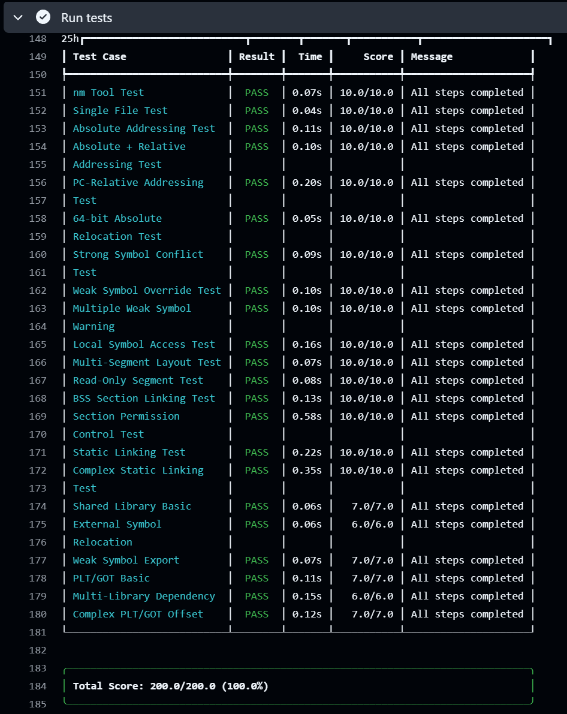

# LinkLab 报告

Autograder 截图：


---

## Part A: 思路简述

链接器的设计主要包含以下几个部分：

- 输入分类：区分目标文件、静态库和动态库，初步扫描符号。

- 归档解析：循环扫描 `.ar` 文件，按需提取成员以解决循环依赖。

- 内存规划：构建 `.got` 和 `.plt` 表，计算各段的虚拟地址及对齐。

- 符号决议：构建全局与局部符号表，确定所有符号的绝对地址。

- 重定位：应用地址修正，支持绝对寻址与 `PC` 相对寻址。

- 输出构建：组装 *FLE* 头、程序头表及节内容。

主要设计了以下数据结构：

```c++
// 全局符号表
struct FinalSymbol { size_t addr; SymbolType type; std::string section; };
std::unordered_map<std::string, FinalSymbol> global_sym_table;

// 局部符号隔离表
std::unordered_map<std::string, std::unordered_map<std::string, size_t>> local_sym_lookup;

// 段合并缓冲区
std::vector<uint8_t> buffers[5]; 

// 动态链接支持
std::unordered_map<std::string, size_t> got_map; 
std::unordered_map<std::string, size_t> plt_map; 
```
<!-- 200字以内简述你的链接器的关键实现思路,重点说明:
1. 核心方法的流程，依次做了什么
2. 关键数据结构的设计，如何组织和管理符号表
-->
---
## Part B: 具体实现分析

### 符号解析实现
<!-- 300字以内,描述:
1. 如何处理不同类型的符号(全局/局部/弱符号)
2. 如何解决符号冲突
3. 实现中的关键优化
4. 关键的错误处理，一些边界情况与 sanity check
-->

符号解析的核心在于维护 `undef_set` 和 `def_set`。

在完成了归档文件的迭代提取后，我们得到了最终参与链接的所有对象文件列表`(final_obj)`。此时遍历这些文件及其符号表:

- 如果这个符号是 *UNDEFINED* 类型，在之前的扫描阶段我们已经处理过它（用于提取静态库成员），在此阶段我们直接跳过，因为我们只关心需要分配地址的实体；

- 如果这个符号是 *LOCAL* 类型，为了避免不同文件间同名静态变量的冲突，我们不再将其放入全局符号表，而是直接将其隔离存储在一个双层映射结构 `local_sym_lookup[filename][symbol]` 中。这样，不同文件变量被隔离，互不干扰；

- 其他情况下（即 *GLOBAL* 或 *WEAK* 符号），为了简化程序，若未发现冲突证据，则默认该符号无冲突，这样我们只要考虑特殊情况即可。这种情况下，依据强弱符号规则进行处理：
  - 如果当前符号是强符号（ *GLOBAL* ），检查全局表中是否已存在同名的强符号。如果是，则报错 `"Multiple definition"` ；如果表中存在的是弱符号，则用当前强符号覆盖。

  - 如果当前符号是弱符号（ *WEAK* ），检查全局表中是否已存在符号。如果不存在，则作为备选写入；如果已存在，我们选择保留表中的原有符号，直接跳过当前符号。

最后，动态库中的符号虽然不参与地址分配，但在前期的扫描中已被记录在 `shared_lib_symbols` 中，用于在最后校验是否所有的 `undef_set` 都得到了满足。

> [!NOTE]
此处有一个逻辑优化：我们不需要对 *LOCAL* 符号查重，因为这是编译器应该完成的部分。一个合法的 `.obj` 文件内部不会出现两个同名的 *LOCAL* 定义，而跨文件的 *LOCAL* 符号通过我们的 `filename` 索引实现了隔离。

以下是处理符号解析的伪代码：

```c++
For each obj in final_objects:
    For each sym in obj.symbols:
        if sym is UNDEFINED: continue

        abs_addr <- segment_start_addrs[type_idx] + section_offsets + sym.offset

        if sym is LOCAL:
            local_sym_lookup[obj.name][sym.name] <- abs_addr
        else:
            if sym is GLOBAL and find sym in global_sym_table:
                existing_entry <- global_sym_table[sym.name]
                if existing_entry.type is GLOBAL:
                    throw runtime_error "Multiple definition of strong symbol"

            if sym not in global_sym_table or 
               (global_sym_table[sym.name].type is WEAK and sym.type is GLOBAL):
                global_sym_table[sym.name] <- {abs_addr, sym.type, sym.section}

For each s in undef_set:
    if s not in shared_lib_symbols: 
        throw runtime_error "Undefined symbol: " + s
```

### 重定位处理
<!-- 300字以内,描述:
1. 支持的重定位类型
2. 重定位计算方法
3. 关键的错误处理
-->

遍历所有待链接的文件及其节，对于每个节中的重定位条目，按照以下流程处理：

- 确定符号地址。为了解决符号冲突并支持动态链接，设定查找优先级：
  - 局部优先：先在 `local_sym_lookup` 中查找，若命中则是当前文件的私有符号。
  
  - 全局查找：若局部未命中，在 `global_sym_table` 中查找。
  
- *GOT/PLT* 拦截。如果重定位类型是 *GOTPCREL* 或 *PC32* 且涉及动态符号，则将 *S* 指向预先分配好的 `.got` 或 `.plt` 条目地址。

- 计算填入值。对于绝对寻址（如 *R_X86_64_64*），公式为 $S + A$。对于相对寻址（如 *R_X86_64_PC32*），公式为 $S + A - P$，其中 $P$ 是重定位发生处的运行时地址。

- 执行写入与校验。在写入前进行安全性检查：特别是对于 *32* 位绝对重定位（*R_X86_64_32*），如果计算结果的高 *32* 位不为 *0* ，则抛出 *Relocation overflow* 异常。校验通过后，直接使用 `memcpy` 将计算结果按小端序填入对应的 `segment buffer` 中。

> [!NOTE]
如果开启了 `-shared` 选项且符号在本地无法解析，链接器不会报错，而是生成动态重定位条目，留给运行时链接器去解决。

这一部分的伪代码如下：

```c++
For each obj in final_objects:
    For each sec in obj.sections:
        current_segment_vaddr <- segment_start_addrs[sec.type] + sec.offset

        For each reloc in sec.relocs:
            P <- current_segment_vaddr + reloc.offset
            S <- 0

            if reloc.symbol in local_sym_lookup[obj.name]:
                S <- local_sym_lookup[obj.name][reloc.symbol]
            else if reloc.symbol in global_sym_table:
                S <- global_sym_table[reloc.symbol].addr
            else if reloc.type is GOT or PLT related:
                S <- lookup_got_or_plt_address(reloc.symbol)

            val <- 0
            switch reloc.type:
                case R_X86_64_64 or R_X86_64_32:   val <- S + reloc.addend
                case R_X86_64_PC32:                val <- S + reloc.addend - P
                case R_X86_64_GOTPCREL:            val <- S + reloc.addend - P

            target_buf <- buffers[sec.type]
            if reloc.type is R_X86_64_32 and (val >> 32) != 0:
                throw runtime_error "Relocation overflow"

            write val to target_buf at (sec.offset + reloc.offset)
```

### 段合并策略
<!-- 300字以内,描述:
1. 如何组织和合并各类段
2. 内存布局的考虑
3. 对齐等特殊处理
-->

预定义 *5* 个缓冲区`(Buffers)`，分别对应 `Text, Rodata, Data, GOT, BSS`。

首先，实现一个映射函数 `get_segment_type`，将输入文件中的节名称映射到 `0~4` 的索引中。遍历所有对象文件时，直接将数据追加到对应的 `buffers[index]` 中。特别地，*PLT* 代码桩被视为 `.text` 的前缀，在合并输入节之前，我们在 `buffers[0]` 起始处预留了 *PLT* 大小的空间，随后追加各目标文件的 `.text` 段，最后将生成的 *PLT* 指令回填至预留的头部空间。

在内存布局规划中：

- 基址确定：可执行文件从 *0x400000* 开始，动态库从 *0x0* 开始。

- 对齐约束：每个 `Segment` 结束时，必须强制进行 *4096 Bytes* 页对齐，从而确保不同权限的段（如只读的 `.text` 和可读写的 `.data`）处于不同的物理内存页中，防止权限位冲突。

> [!NOTE]
由于 `.bss` 段在磁盘文件中不占空间，我们不能将其数据 `push_back` 到缓冲区中，而是单独维护一个 `bss_size` 计数器。在计算地址时加上它，但在写入文件时跳过它。

以下是段合并与布局策略的伪代码：

```c++
For each obj in final_objects:
    For each sec in obj.sections:
        type_idx <- get_segment_type(sec.name)
        if type_idx == -1: continue

        section_offsets[(obj, sec)] <- buffers[type_idx].size
        
        if type_idx == BSS:
            bss_size <- bss_size + sec.size
        else:
            buffers[type_idx].append(sec.data)

cur_vaddr <- 0x400000
For i <- 0 to 4:
    segment_starts[i] <- cur_vaddr

    seg_size <- (i == BSS) ? bss_size : buffers[i].size
    
    cur_vaddr <- cur_vaddr + seg_size

    if cur_vaddr % 4096 != 0:
        cur_vaddr <- (floor(cur_vaddr / 4096) + 1) * 4096
```
---

## Part C: 关键难点解决
<!-- 选择2-3个最有技术含量的难点:
1. 具体难点描述
2. 你的解决方案
3. 方案的效果
示例难点:
- 重复符号处理
- 重定位越界检查
- 段对齐处理
-->

#### 静态库的循环依赖与迭代解析算法

在处理 `.ar` 文件时，难点在于如何正确处理符号的依赖链。一个核心问题是：提取库中的成员 *A* 可能会引入新的未定义符号，而这些符号可能由同一个库中的成员 *B* 定义，或者由前面已经扫描过的库定义。如果仅进行一次线性扫描，容易导致符号解析不全。于是设计了一个基于状态变更的迭代算法来解决这个问题。

**难点分析**：

- **符号依赖的后向性**：在扫描库 `libx.a` 时，发现需要提取成员 `foo.o`，而 `foo.o` 依赖 `bar.o`（也在 `libx.a` 中）。如果我们只遍历一次 `libx.a`，在扫描到 `bar.o` 时可能还没发现它被需要（因为 `foo.o` 可能排在 `bar.o` 后面）。

- **避免重复提取**：必须记录哪些成员已经被提取过，防止重复链接导致的符号重定义错误。

**解决方案**：
利用一个 `while` 循环，不断重复扫描所有的归档文件，直到在一次完整的遍历中没有新的成员被提取为止。

核心策略伪代码如下：

```c++
changed <- true
extracted_set <- empty set

While changed is true:
    changed <- false
    
    For each ar in archives:
        For each member in ar.members:
            id <- generate_id(ar, member)
            if id in extracted_set: continue

            is_needed <- false
            For each sym in member.defined_symbols:
                if sym in global_undef_set:
                    is_needed <- true
                    break

            if is_needed is true:
                final_link_queue.push(member)
                extracted_set.insert(id)
                changed <- true

                For each sym in member.symbols:
                    if sym is UNDEFINED:
                        global_undef_set.insert(sym)
                    else if sym is GLOBAL_DEFINED:
                        global_def_set.insert(sym)
                        global_undef_set.remove(sym)
```

这种设计确保了无论静态库内部的依赖顺序是什么样的，或者存在循环依赖的情况，链接器最终都能正确提取所有必要的对象文件。


#### 局部符号解析与重定位中的名称冲突处理 
**难点分析**：
 在链接过程中，局部符号与全局符号不同，具有文件作用域，即不同目标文件中可以存在同名的局部变量。链接器必须确保一个目标文件中的重定位引用正确指向这个文件定义的局部变量，而不能错误地链接到别的文件中同名的局部变量或其他同名的全局变量。

一种朴素的解决方案是通过字符串拼接将文件名与符号名组合（例如将 `cnt` 重命名为 `a.o::cnt`），并将其统一存储在全局符号表中。但这种方案存在缺陷：

- **性能损耗** ：在解析和重定位时，需要进行频繁的字符串拼接操作。

- **潜在污染风险** ：虽然概率低，但依然存在拼接后的名称与某个复杂的全局符号名称发生碰撞的风险。

**解决方案**：

设计了一种 **分级存储结构** 来实现作用域隔离。

- **数据结构设计**

使用嵌套的哈希表来隔离不同文件的符号表：


```c++
// 外层 Key 为目标文件名 (Object Name)，内层 Key 为符号名 (Symbol Name)
// Value 为计算后的绝对地址
std::unordered_map<std::string, std::unordered_map<std::string, size_t>> local_sym_lookup;
```

该结构建立了一个二维的查找空间：第一维是文件作用域，第二维是符号名称。

- **核心策略**

  - **符号扫描阶段**： 在遍历输入对象时，如果遇到 `SymbolType::LOCAL` 类型的符号，将其绝对地址存入 `local_sym_lookup[obj.name]` 中，而不是混入 `global_sym_table`。

  - **重定位阶段**： 当处理某个目标文件的重定位项时，系统采用就近原则解析：

    - **优先查找局部作用域**：首先在 `local_sym_lookup[obj.name]` 中查找符号。

    - **回退至全局作用域**：只有当局部表中不存在该符号时，才去查询 `global_sym_table`。

由于我们每次遍历文件只把当前文件的局部变量载入，这样在处理这个文件的时候别的文件的局部符号是不可见的，于是解决了名称问题冲突。

#### PLT/GOT 构建

**难点分析**：

当代码调用一个共享库函数时，编译器生成的指令通常是 `call relative_offset`。然而：
- **地址不确定**：共享库函数的实际地址只有在程序运行时加载器加载 `libc.so` 后才能确定，链接器无法直接回填。

- **代码段不可写**：为了实现共享库在内存中的多进程共享，`.text` 段通常是只读的。如果在运行时直接修改代码段中的 `call` 指令目标，会破坏共享机制。

**解决方案**：

- **引用类型分类**：
在扫描重定位表时，根据重定位类型和符号属性决定策略：
  * **数据访问 (`R_X86_64_GOTPCREL`)**：在 *GOT* 中分配一个 *8* 字节槽位，用于运行时存放变量的绝对地址。
  * **动态函数调用 (`R_X86_64_PC32` + 动态符号)**：不仅需要在 *GOT* 中分配槽位，还需在 *PLT* 中生成一段桩代码。


- **PLT 桩代码的动态构建**：
对于每个需要 PLT 的函数，写入特定的 *x86-64* 机器码：
```assembly
jmp *offset(%rip) 
```

这里为了简化并没有使用 *Lazy Binding* ，对于每个需要 *PLT* 的函数，仅生成一条间接跳转指令。

难点在于计算 `jmp *offset(%rip)` 中的 `offset`。这个偏移量是当前指令末尾地址到对应 *GOT* 条目地址的距离。

- **动态重定位项**：
静态链接器不填充 *GOT* 表的具体数值，而是生成指示绝对地址填充的动态重定位项，将其写入输出文件的 `.rela.dyn` 或 `.rela.plt` 段，指示加载器在运行时填入真值。

核心策略伪代码如下：

```c++
For each reloc in input_sections:
    is_dynamic_call <- (reloc.type is R_X86_64_PC32) AND (reloc.symbol in shared_lib_symbols)
    
    if is_dynamic_call is true:
        if reloc.symbol not in plt_map:
            plt_index <- plt_entries.size
            got_index <- got_entries.size
            
            plt_map[reloc.symbol] <- plt_index
            got_map[reloc.symbol] <- got_index
            
            plt_entries.push(reloc.symbol)
            got_entries.push(reloc.symbol)

index <- 0
For each sym in plt_entries:
    plt_entry_addr <- plt_start_vaddr + (index * 6)
    got_entry_addr <- got_start_vaddr + (got_map[sym] * 8)

    next_rip <- plt_entry_addr + 6
    offset <- got_entry_addr - next_rip

    stub_code <- generate_plt_stub(offset) 
    
    output_buffer.write(stub_code)

    index <- index + 1

For each sym in got_entries:
    got_entry_addr <- got_start_vaddr + (got_map[sym] * 8)
    
    dyn_rel <- new Relocation
    dyn_rel.type <- R_X86_64_64
    dyn_rel.symbol <- sym
    dyn_rel.offset <- got_entry_addr
    
    dynamic_relocs_list.push(dyn_rel)
```
---

## Part D: 实验反馈
<!-- 芝士 5202 年研发的船新实验，你的反馈对我们至关重要
可以从实验设计，实验文档，框架代码三个方面进行反馈，具体衡量：
1. 实验设计：实验难度是否合适，实验工作量是否合理，是否让你更加理解链接器，链接器够不够有趣
2. 实验文档：文档是否清晰，哪些地方需要补充说明
3. 框架代码：框架代码是否易于理解，接口设计是否合理，实验中遇到的框架代码的问题（请引用在 repo 中你提出的 issue）
-->

对我来说，这是一个很棒的实验。我在期末考试前完成了 `task1 ~ task7` ，然后在期末后完成了两个 `bonus` 任务。对我来说，前 *7* 个任务不算特别难，似乎只是在 `task5` 和`task7` 卡了一下，但也没有耗费特别多时间。两个 `bonus` 任务难一些，但最终在 `AI` 的帮助下也完成了 ~~（赞美 *Gemini* ）~~。实验整体很有趣味性，攻克一个一个阶段，最终拿到满分的感觉非常棒。

实验框架和文档都非常棒，还是比较容易理解的。对我来说，一个难点可能是 `fle.hpp` 里定义的数据结构很多，再加上我自己定义了不少数据结构，需要时常对照着写。还有一个就是感觉这个 *Lab* 挺难上手的，可能是因为 *FLE* 格式有点抽象，刚开始的时候感觉云里雾里，但最终配合 *AI* 搞懂了。

总之，这是个很棒的 *Lab* 。手工模拟一个 *Linker* 对于链接的学习很有意义，也很有成就感。感谢助教们这一学期的付出，赞美助教！赞美 *ICS* ！

## 参考资料 
<!-- 对实现有实质帮助的资料 -->

- [程序员的自我修养：链接、装载与库](https://awesome-programming-books.github.io/others/%E7%A8%8B%E5%BA%8F%E5%91%98%E7%9A%84%E8%87%AA%E6%88%91%E4%BF%AE%E5%85%BB%EF%BC%9A%E9%93%BE%E6%8E%A5%E3%80%81%E8%A3%85%E8%BD%BD%E4%B8%8E%E5%BA%93.pdf)

> 很详细地介绍了链接器的基础知识，特别是其中与共享库有关的部分对我帮助很大

- [链接、装载与库 --- 动态链接](https://markrepo.github.io/kernel/2018/08/19/dynamic-link/)

> 详细地讲述了有关动态链接的基础知识，对我的`bonus`任务帮助很大